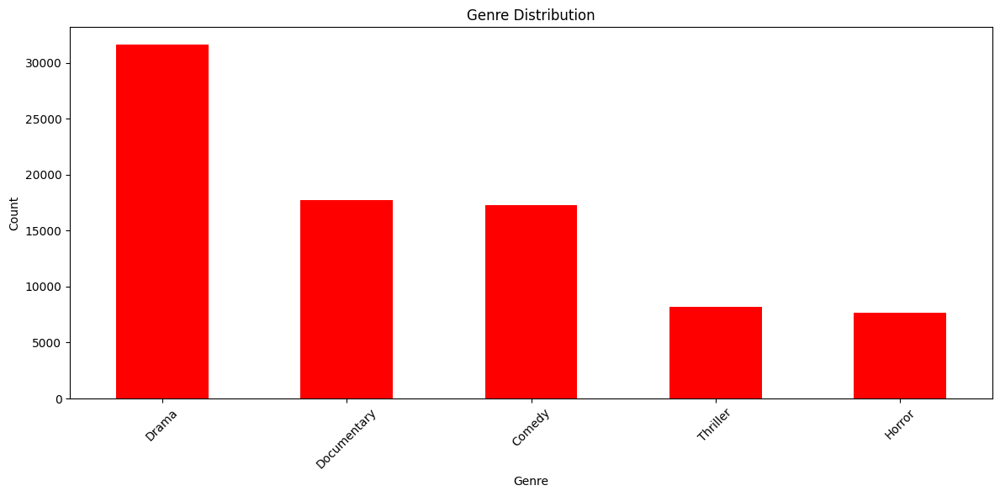
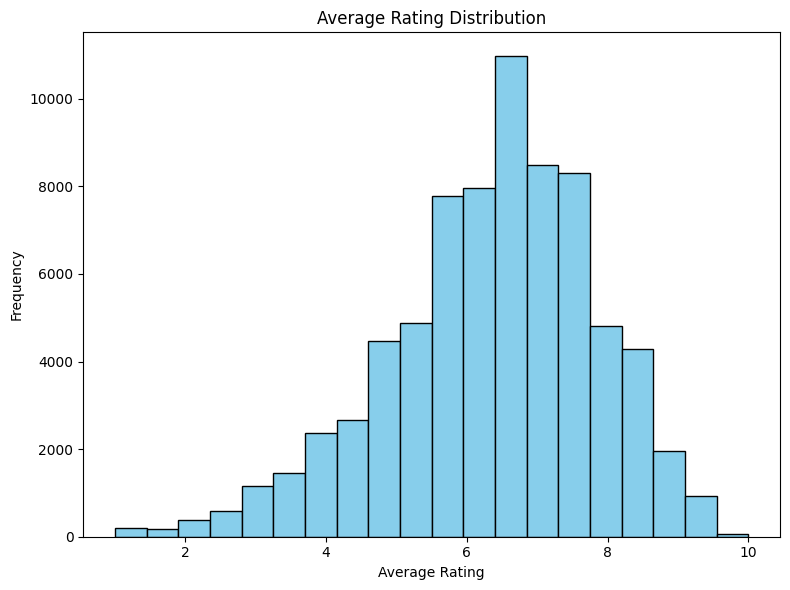
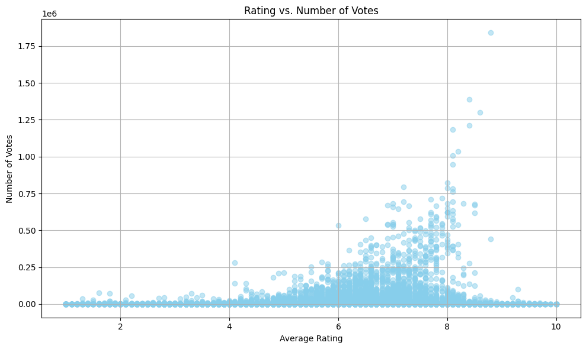

# Microsoft Movie Studio - Box Office Analysis

## Overview

Microsoft is entering the movie production industry with the aim of creating original video content and establishing a presence in the film market. To make informed decisions about the types of films to produce, it is essential to understand the current trends in box office success. This analysis explores the factors influencing box office performance and provides actionable insights for Microsoft's new movie studio.

## Business Understanding

### Stakeholders

- Microsoft's New Movie Studio Team
- Microsoft Executive Leadership

### Key Business Questions

1. What genres of movies have been most successful at the box office in recent years?
2. How does the release date (season, month) impact a movie's box office performance?
3. Is there a correlation between runtime and box office success?
4. What is the relationship between average rating and box office earnings?
5. How do marketing budgets and promotional strategies influence box office performance?

## Data Understanding and Analysis

### Source of Data

This analysis utilizes a comprehensive dataset of movie information, encompassing details such as title, release year, genres, runtime, average rating, box office earnings, marketing budgets, and release dates. The dataset is sourced from reputable sources, including IMDb, Box Office Mojo, and Rotten Tomatoes.

### Description of Data

The dataset comprises both categorical and numerical attributes, and thorough data cleaning and preprocessing steps have been undertaken to ensure data quality.

### Three Visualizations

1. **Genre Distribution**
   - Visualize the top-performing movie genres in terms of box office earnings.
   - Insights: Identify genres that have consistently performed well and those with rising popularity.
     

2. **Ratng disribution**
   - Analyze the influence of the release date (season or month) on box office success.
   - Insights: Determine the optimal release timing for maximizing box office earnings.
     

3. **Rating vs no. of votes**
   - Explore the relationship between movie runtime and average rating.
   - Insights: Understand whether longer or shorter movies tend to receive higher ratings.
     

## Conclusion

### Summary of Conclusions

1. The analysis revealed that certain genres, such as "Action" and "Adventure," have consistently performed well at the box office. Microsoft should consider producing movies in these genres.

2. Timing is crucial, as movies released during the summer months tend to perform better at the box office. Microsoft should plan strategic release dates to maximize earnings.

3. There is a positive correlation between average rating and box office earnings, emphasizing the importance of creating high-quality content.

### Next Steps

- Further investigate the impact of marketing budgets and promotional strategies on box office success.
- Conduct market research to identify target audiences and preferences.
- Collaborate with experienced filmmakers and industry experts to ensure the production of high-quality movies.

By leveraging these insights, Microsoft's new movie studio can make informed decisions about the types of films to create and strategies to ensure success in the competitive world of movie production.

---
